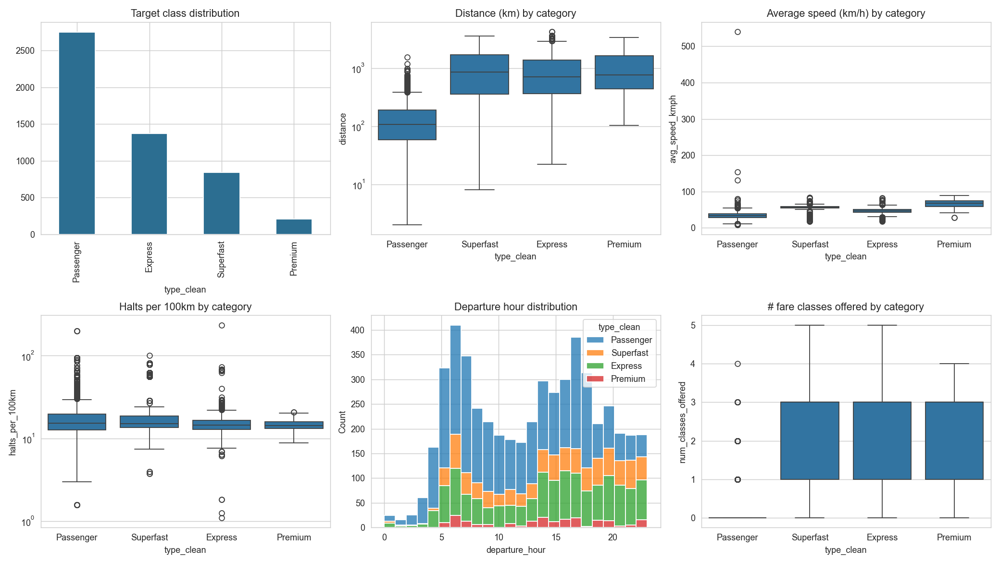
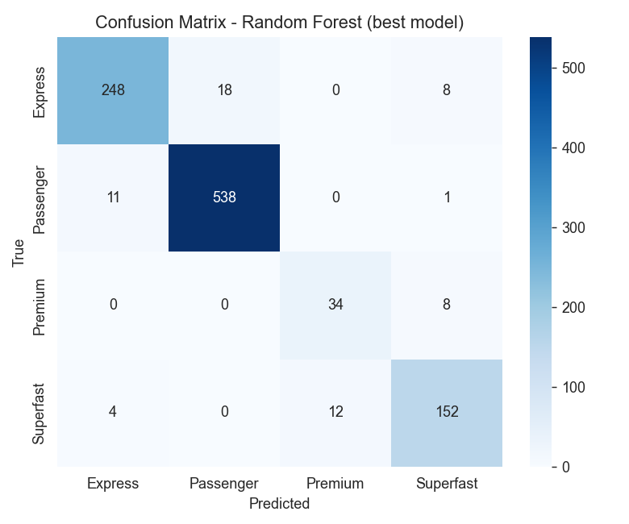
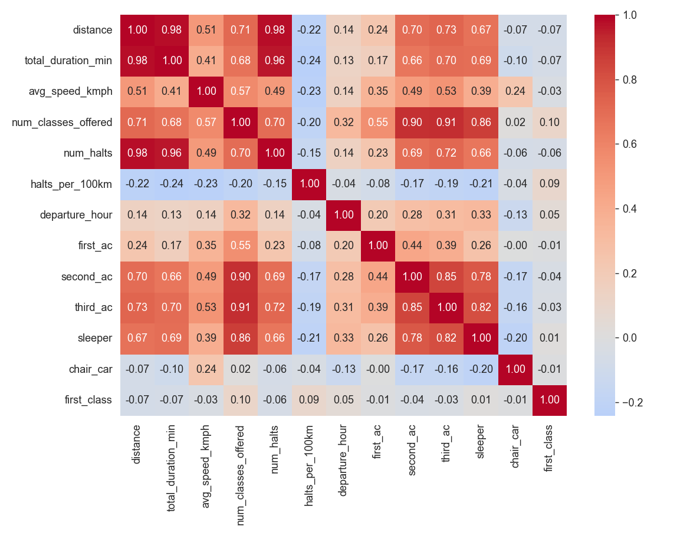
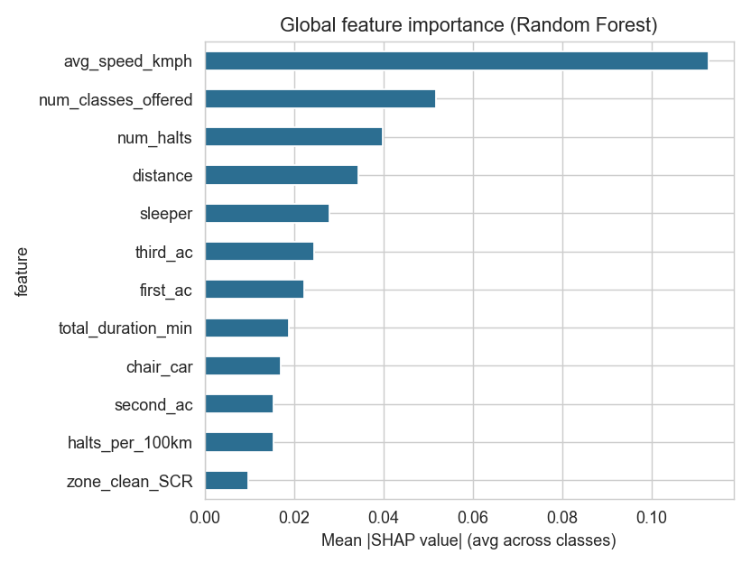
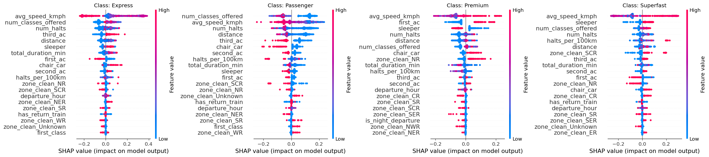

# Indian Railways Train Category Classification

A machine learning project that predicts a train's official service category (**Passenger**, **Express**, **Superfast**, or **Premium**) using structural route characteristics such as distance, average speed, halt density, fare classes offered, railway zone, and departure time. The project is built on real, CC0-licensed Indian Railways data and demonstrates an end-to-end machine learning workflow, from data cleaning and feature engineering to model interpretation using SHAP.

## Why this project

Many portfolio projects rely on pre-processed or synthesized datasets. This project instead works directly with the original **datameet/railways** JSON files, requiring extensive data cleaning, feature engineering, and handling of real-world inconsistencies such as missing values, noisy labels, and class imbalance. The dataset contains approximately **5,200 trains** and **417,000 station-level schedule records**, making it a realistic machine learning classification problem.

## Project Overview

### Exploratory Data Analysis



### Model Performance




### Model Explainability




## Tech Stack

- Python
- Pandas
- NumPy
- Scikit-learn
- Matplotlib
- SHAP
- Joblib
- Jupyter Notebook

## Machine Learning Pipeline

1. **Data Acquisition** – Loaded `trains.json`, `stations.json`, and `schedules.json` from the original GitHub dataset.
2. **Data Validation** – Verified suspicious records (e.g., trains with exceptionally high halt counts) before analysis.
3. **Data Cleaning** – Removed invalid entries and consolidated 17 raw train types into four operational categories.
4. **Feature Engineering** – Generated features including average speed, halt density, fare-class count, departure hour, and railway zone.
5. **Model Development** – Trained and evaluated Dummy Classifier, Logistic Regression, Random Forest, and Gradient Boosting models using stratified train-test splits.
6. **Model Interpretation** – Applied SHAP to explain feature contributions and interpret model decisions.
7. **Analysis** – Discussed why average speed naturally dominates prediction due to Indian Railways' classification rules while acknowledging the model's limitations.

## Model Performance

| Model | Macro-F1 Score |
|--------|---------------:|
| Dummy Classifier | 0.17 |
| Logistic Regression | 0.77 |
| **Random Forest** | **0.90** |
| Gradient Boosting | 0.89 |

The **Random Forest** classifier achieved the best overall performance with a **Macro-F1 score of 0.90**, substantially outperforming the baseline and demonstrating strong predictive performance across the imbalanced train categories.

## Repository Structure

```text
Indian_Railways_Classification/
│
├── Indian_Railways_Train_Classification.ipynb
├── README.md
├── requirements.txt
│
├── data/
│   ├── trains.json
│   ├── stations.json
│   ├── schedules.json
│   └── model_ready.csv
│
├── figures/
│   ├── eda_overview.png
│   ├── confusion_matrix.png
│   ├── correlation_heatmap.png
│   ├── feature_importance.png
│   └── shap_summary_per_class.png
│
└── models/
    ├── random_forest_pipeline.joblib
    ├── gradient_boosting_pipeline.joblib
    ├── feature_importance.csv
    └── results_summary.json
```

## Installation and Usage

```bash
git clone https://github.com/Swaroop-Haridas/Indian_Railways_Classification.git
cd Indian_Railways_Classification

pip install -r requirements.txt

jupyter nbconvert --to notebook --execute --inplace Indian_Railways_Train_Classification.ipynb
```

Alternatively, open the notebook in Jupyter Notebook or VS Code and execute all cells.

## Limitations

- The source dataset represents Indian Railways data from **2016**, so newer train categories (e.g., Vande Bharat) are not included.
- Consolidating 17 original train types into four categories is a documented but subjective design choice.
- Since train categories are partially defined by operational characteristics such as speed and amenities, the model primarily learns these underlying rules rather than discovering entirely independent relationships.

## Data Source

- **Dataset:** https://github.com/datameet/railways
- **License:** CC0 (Public Domain)
